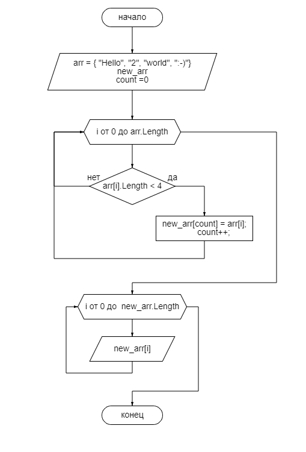

# Control_work

## Решение
1. Создаем массив строк arr, пустой массив new_arr с длинной arr и переменную count равным 0
2. Запускаем цикл по длинне массива arr. Првоеряем каждый элемент на соответствие длинны строки меньше 4 символов

    2.1 Если элемент прошел проверку, добавляем его в массив new_arr в позицию count и увеличиваем счетчик count на 1

    2.2 Если элемент не прошел проверку, то переходим к следующей итерации

3. Запускаем цикл по длинне массива new_arr и выводим на экран каждый элемент

Блок-схема

